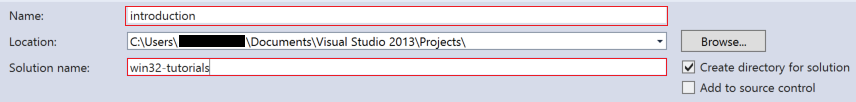
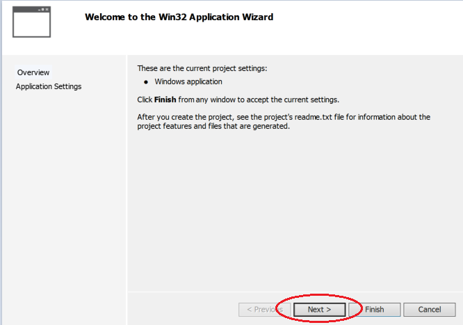
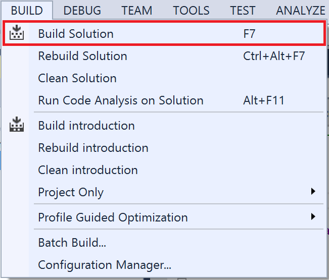

#Introduction

##Purpose

The purpose of this tutorial is to introduce readers to the use of Visual Studio at it's simplest form. This tutorial will cover the process of creating; building; launching a minimalist Win32 API application. Readers will have the chance to familiarize themselves with fundamental user interfaces panels and controls, as these are important tools for future tutorials.

##Intended audience
This tutorial is preliminarily intended for people with limited experience in Visual Studio. However, it is important to note that a strong, preferably advanced, understanding of the C/C++ programming language is required for future tutorials.
In this case, readers should refer to external C++ references for memory refresh and practice before taking onto further tutorials.

##Objectives
* **Familiarize with user interface**
* **Create, build, execute project**

##Table of content
1. [A quick look at VS's user interface](https://github.com/malortie/Tutorials/wiki/Win32-API---Introduction#step-1-a-quick-look-at-vss-user-interface)
2. [Creating the project](https://github.com/malortie/Tutorials/wiki/Win32-API---Introduction#step-2-creating-the-project)
3. [Building the solution](https://github.com/malortie/Tutorials/wiki/Win32-API---Introduction#step-3-building-the-solution)
4. [Launching from Visual Studio](https://github.com/malortie/Tutorials/wiki/Win32-API---Introduction#step-4-launching-from-visual-studio)

--

#Step 1. A quick look at VS's user interface

Launch [Visual Studio 2013](https://www.visualstudio.com/en-us/downloads/download-visual-studio-vs.aspx). You should see the start page empty, as no projects have been created.  

***Note***: If you are logged as a local user/guest or if you do not have a [Microsoft account](http://en.wikipedia.org/wiki/Microsoft_account), you will be prompted to [create one](https://login.live.com/). This step is **optional**.

|ID|Name|Details|
|:--:|:--|:--|
|**_1_** | **Menubar** | This is the most important and fundamental of all projects related creation procedure. Menubar is a navigation utility to be used for interacting with Visual Studio. |
|**_2_** | **Toolbar** | This control is a set of tools, mostly consisting of shortcuts, instead of using the menu bar. |
|**_3_** | **Solution explorer** | Readers should refer to this panel for any operation related to workspace or project managment. |
|**_4_** | **Text editor** | This is where readers should write code. |
|**_5_** | **Property window** | Used to display the properties of a particuliar selected item in either solution explorer such as a file or a control in design window. |
|**_6_** | **Output window** | When a project is compiling, this window is mainly used to observe build progression. It is important to keep an eye on this panel while building, as several useful informations such as warning, function deprecation or compile errors will show up in this area. |

#Step 2. Creating the project

To create a project, click on **New Project...**

--

--

You will be asked to select what type of project to create, in this tutorial, we will use by default **Win32 Project**.  

To create a Win32 C++ application, in the window, select to **Visual C++** **→** **Win32** **→** **Win32 Project**

--

By default, Visual Studio will name your **workspace** the same as your project. As clarity plays an important role in software development, it would be benefical to separate names of both *project* and *workspace*.  

In the **Name** field, rename **Win32Project1** to **introduction**.  
In the **Solution name** field, rename **Win32Project1** to **win32-tutorials**.

Once the proper changes are done, click **OK** to start up the application wizard.

--

The **Win32 application wizard** will open to help you configure and setup project settings.  

By default, **Win32 appplication wizard** comes with a template which takes care of creating a [single document interface](http://en.wikipedia.org/wiki/Single_document_interface) application so that it allows for you to begin implenting features instead of spending 10 minutes configuring and setting resources such as [menus](https://msdn.microsoft.com/en-us/library/windows/desktop/ms647553(v=vs.85).aspx), [strings](https://msdn.microsoft.com/en-us/library/windows/desktop/ms647465(v=vs.85).aspx), [dialogs](https://msdn.microsoft.com/en-us/library/windows/desktop/ms644994(v=vs.85).aspx).  

I will not explain or describe too much in depth, as these will be covered later in sections for advanced programming.

For now, simply click **Next**.

--

On the second page of the **Win32 application wizard**, you will be asked to select a particuliar type of application.

By default, when you choose to create a **Win32 project**, the selected option will be **Win32 Application**. **Addition options** such as **Empty Project**, or **Security Development LifeCycle** can be tweaked. However, for the purpose of this project, we will leave options as they are.

Click on **Finish** to both complete and close project configuration wizard.

--

Once code generation from Win32 template samples is done, your main [IDE](http://en.wikipedia.org/wiki/Integrated_development_environment) view in Visual Studio should look to this.

--

-

###If this is not the case

***Pausible causes are listed below:***

* You did not select **Win32 Project**
* On the second page of **Win32 application wizard**
  * In *Application type*, **Win32 Application** was not checked
  * In *Additional options*, you checked **Empty Project**  

--

#Step 3. Building the solution

####Using the menu bar

Proceed to the menu bar and click on **BUILD** **→** **Build Solution**.  

Very often, programmers may want to use shortcuts to avoid navigation through menus in order to use a particuliar feature.

**Build Solution** can be done as well by pressing shortcut key **F7**.

--

####Using the solution explorer

**Build Solution** can also be done in the **Solution Explorer** section, usually located on the left side of the [IDE](http://en.wikipedia.org/wiki/Integrated_development_environment).

From the **Solution Explorer**, right-click on the solution, **win32-tutorials** in this case,  and then select **Build Solution**.  

***Note***:  To build the entire solution will build all projects associated to it. If you wish to on;y build a single project, then rick click on the project, **introduction** in this case, and select **build**.

--

By default, once a build has started, Visual Studio will automaticaly switch to the **Output Window** so that you may see the progression of the build.

Assuming that no code modification was made, the build should be successful.

--

#Step 4. Launching from Visual Studio

In the main, **Tool bar** at the top, below the **Menu bar**, you should notice a button with a green arrow symbol, **Local Windows Debugger**.

This is a way for launch the application in **Debug Mode**. By default, **Debug Mode** is always selected. You can change the mode to **Release**, which will prevent the debugger from stepping into functions when data inspection is required.

During development, it is often a good practice to launch in **Debug Mode**.

--

Once debugging has started, it is possible to see the main **dependencies** in the **Output** window that are loaded by Windows before running the application.  

In a POSIX, or unix environment, these modules are equivalent to [shared libraries](http://en.wikipedia.org/wiki/Library_%28computing%29#Shared_libraries), except they have **\.so** as their extension.

Since this is a simple **Win32** C++ application,  only the base modules are loaded, such as 

* **combase.dll**, 
* **kernel32.dll**, 
* **user32.dll**, 
* **msvcr120d.dll**  

There are more than these, but I will not list them here, as I will describe a part of their content more in depth in future tutorials.

--

As for the **Win32 C++ application**, The result should look like this:

