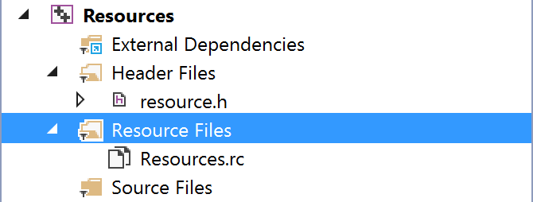
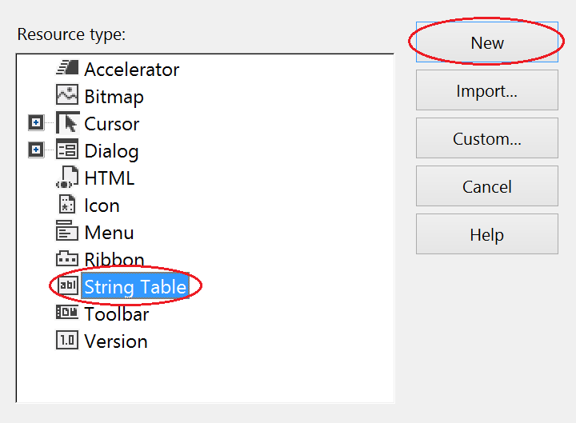

#Resources

##Purpose

The purpose of this tutorial is to demonstrate the basics of resource creation and utilization. By the end of this tutorial, readers should be able to load resources from a predefined file and apply it to a window.

##Intended audience

This tutorial requires basic knowledge of [Visual Studio](https://www.visualstudio.com/). It is recommended to have read [Simple Window](../simple-window/simple-window.md)  before proceeding. As stated in previous tutorials, readers should be proficient in C/C++, as this tutorial does not cover the [C++ programming language](http://en.wikipedia.org/wiki/C%2B%2B).

##Objectives

* _Preparing the project_.
* _A gentle introduction to resources_.
* _Learn and use [Visual Studio](https://www.visualstudio.com/)'s resource editor to create resources_.
* _Apply resources in code_.

##Table of content

1. [Preparations](#preparations)
* [A brief overview about resources](#a-brief-overview-about-resources)
  1. [What is a resource?](#what-is-a-resource)
  * [Benefits](#benefits)
  * [Inconveniences](#inconveniences)
* [Creating resources](#creating-resources)
  1. [Standard resource menu](#standard-resource-menu)
  * [Cursors](#cursors)
  * [Icons](#icons)
    1. [Large icon](#large-icon)
    * [Small icon](#small-icon)
  * [String table](#string-table)
* [Resource view & designer](#resource-view--designer)
  1. [Cursor](#cursor)
  * [Icons](#icons-1)
* [The file resource.h](#the-file-resourceh)
* [The code](#the-code)
  1. [Headers](#headers)
  * [Declarations](#declarations)
  * [Loading resources](#loading-resources)
    1. [Loading strings from the table](#loading-strings-from-the-table)
    * [Loading cursors](#loading-cursors)
    * [Loading icons](#loading-icons)
  * [Window class](#window-class)
* [Project build](#project-build)  
* [Conclusion](#conclusion)
* [Complete example](#complete-example)

#Preparations

> **Note:**  
> Assumptions are made that readers are comfortable with
> creating, compiling, building, launching projects, along with adding items
> such as files, new projects to solutions. If this is not the case, readers
> should refer to [previous tutorials](../simple-window/simple-window.md).

Open up [Visual Studio](https://www.visualstudio.com/). If you wish, you can create a new workspace or use the [existing solution](../introduction/introduction.md). Create/add a new **Win32 Project**. In **Additional setting**, check **Empty**. Once the **Win32 application wizard** has finished creating the solution, add [Resources.cpp](src/Resources.cpp) to the project.

For a quick _Copy & Paste_ action, here is it's content.

```c
// Resources.cpp

// Header required to help detect window version
#include <sdkddkver.h>

// Macro used to reduce namespace pollution
#ifndef WIN32_LEAN_AND_MEAN
#define WIN32_LEAN_AND_MEAN
#endif

// Reference for various Win32 API functions and
// structure declarations.
#include <Windows.h>

// Header needed for unicode adjustment support
#include <tchar.h>

//
//
// WndProc - Window procedure
//
//
LRESULT
CALLBACK
WndProc(HWND hWnd, UINT uMsg, WPARAM wParam, LPARAM lParam)
{
	switch (uMsg)
	{
	case WM_DESTROY:
		::PostQuitMessage(0);
		break;
	default:
		return ::DefWindowProc(hWnd, uMsg, wParam, lParam);
	}

	return 0;
}

//
//
// WinMain - Win32 application entry point.
//
//
int
APIENTRY
wWinMain(
	HINSTANCE hInstance,
	HINSTANCE hPrevInstance,
	LPWSTR lpCmdLine,
	int nShowCmd)
{
	// Setup window class attributes.
	WNDCLASSEX wcex;
	ZeroMemory(&wcex, sizeof(wcex));

	wcex.cbSize			= sizeof(wcex);	// WNDCLASSEX size in bytes
	wcex.style			= CS_HREDRAW | CS_VREDRAW;		// Window class styles
	wcex.lpszClassName	= TEXT("MYFIRSTWINDOWCLASS");	// Window class name
	wcex.hbrBackground	= (HBRUSH)(COLOR_WINDOW + 1);	// Window background brush color.
	wcex.hCursor		= LoadCursor(hInstance, IDC_ARROW); // Window cursor
	wcex.lpfnWndProc	= WndProc;		// Window procedure associated to this window class.
	wcex.hInstance		= hInstance;	// The application instance.

	// Register window and ensure registration success.
	if (!RegisterClassEx(&wcex))
		return 1;

	// Setup window initialization attributes.
	CREATESTRUCT cs;
	ZeroMemory(&cs, sizeof(cs));

	cs.x			= 0;	// Window X position
	cs.y			= 0;	// Window Y position
	cs.cx			= 640;	// Window width
	cs.cy			= 480;	// Window height
	cs.hInstance	= hInstance; // Window instance.
	cs.lpszClass	= wcex.lpszClassName;		// Window class name
	cs.lpszName		= TEXT("My First Window");	// Window title
	cs.style		= WS_OVERLAPPEDWINDOW;		// Window style

	// Create the window.
	HWND hWnd = ::CreateWindowEx(
		cs.dwExStyle,
		cs.lpszClass,
		cs.lpszName,
		cs.style,
		cs.x,
		cs.y,
		cs.cx,
		cs.cy,
		cs.hwndParent,
		cs.hMenu,
		cs.hInstance,
		cs.lpCreateParams);

	// Validate window.
	if (!hWnd)
		return 1;

	// Display the window.
	::ShowWindow(hWnd, SW_SHOWDEFAULT);
	::UpdateWindow(hWnd);

	// Main message loop.
	MSG msg;
	while (::GetMessage(&msg, hWnd, 0, 0) > 0)
		::DispatchMessage(&msg);

	// Unregister window class, freeing the memory that was
	// previously allocated for this window.
	::UnregisterClass(wcex.lpszClassName, hInstance);

	return (int)msg.wParam;
}
```

#A brief overview about resources

##What is a resource?
In Windows operating system, a resource constitutes a binary data that is embedded in programs, or dynamic-linked libraries (DLL). By default, system resources include:

* [Carets](https://msdn.microsoft.com/en-us/library/windows/desktop/ms646968%28v=vs.85%29.aspx)
* [Cursors](https://msdn.microsoft.com/en-us/library/windows/desktop/ms646970(v=vs.85).aspx)
* [Icons](https://msdn.microsoft.com/en-us/library/windows/desktop/ms646973(v=vs.85).aspx)
* [Keyboard Accelerators](https://msdn.microsoft.com/en-us/library/windows/desktop/ms645526(v=vs.85).aspx)
* [Menus](https://msdn.microsoft.com/en-us/library/windows/desktop/ms646977(v=vs.85).aspx)
* [Strings](https://msdn.microsoft.com/en-us/library/windows/desktop/ms646979(v=vs.85).aspx)

##Benefits

* Ability to be embedded in [EXE](http://en.wikipedia.org/wiki/.exe);[DLL](http://en.wikipedia.org/wiki/Dynamic-link_library);[MUI](http://en.wikipedia.org/wiki/Multilingual_User_Interface) files.
* Are [Read Only](http://en.wikipedia.org/wiki/Read-only_memory), which prevent against unwanted modification.
* Ideal for [internationalization and localization](http://en.wikipedia.org/wiki/Internationalization_and_localization), as well as [multilingual user interface](http://en.wikipedia.org/wiki/Multilingual_User_Interface).

##Inconveniences

* Embedded resources increase file size.

#Creating resources

##Standard resource menu

There are various ways to create resources. In this tutorial, we will create them using [Visual Studio](https://www.visualstudio.com/)'s resource editor. It is possible to create resources in code, however these will be covered in future tutorials, as understanding the basics of resources is needed before attempting to do harder problems.

In the solution explorer, right-click on **Resource Files**.


Add a new resource.


After selecting **Add Resource**, in the **solution explorer**, you will notice two new files under both **Header Files** & **Resource Files**: **resource.h**, **Resource.rc**. This is perfectly normal, as [Visual Studio](https://www.visualstudio.com/) is creating these files to store information about that kind of resource we use, the value attributed to these resources, etc.



You should see a similar window of the following:


This is where we will create the necessary resources to make use in this tutorial. There are three types of resources to be created for the tutorial, cursors, icons, strings.

##Cursors

Add a new cursor by expanding the section **Cursor** and add a resource of type _IDC_POINTER_. Then click **New**. This will represent the the cursor to be used by our [previously defined window class](../simple-window/simple-window.md).


##Icons

In Windows, icons can be represented as small, medium, large. For this reason, we need to create multiple sizes of a same icon for optimal display. In this tutorial, we will use two icons, one _32x32_ and another _16x16_.

Start by selecting icon and click **New**.


###Large icon

By default, your icon's resolution will be set to _32x32, 4 bits, BMP_.
Change it to a 32 bit by selecting _32x32, 32 bits, BMP_. Then save it by pressing **Ctrl+S** or right-click on the **icon1.ico** tab and **save icon1.ico**


###Small icon

For this step, proceed the same way as seen in [Large Icon](#large-icon), but set the size of the icon type to _16x16, 32 bits, BMP_. Don't forget to save it.

##String table

Finally, the string table, which will contain literal definitions for our window to make use of. To add a string table, add a new resource and select **String Table**.



You should see the following menu.


This is the string resource editor. You can edit string captions, values as well of names. Before doing so, add a new string by pressing **INS** or right-click and select **New String**.


You should now have two strings in your string table. In order to enhance clarity, we will edit these values so that we will not accidently mix system-defined values with our own.

For the first string, IDS\_STRINGX (where X is a digit), we will change it's **ID** to IDS\_MYAPP\_TITLE. Give this string **Value** _101_ and change it's **Caption** to _Hello World!_

As for the second string, change it's **ID** to _IDS\_MYAPP\_CLASS_, set it's **Value** to 102, change the **Caption** to _MYAPPCLASS_.


#Resource view & designer

In order to edit resources, you will be required to switch from **Solution Explorer** to **Resource View**. To make the switch, proceed to the footer of the left pane,  precisely: the **Solution Explorer**. You should see several other tabs such as **Class view**, **Property manager**, **Resource View**, **Team Explorer**, etc.

Select **Resource View**.


The pane content will then be replaced with the following:


Click on the left arrow of each folder and subfolder. Expand all sections. You should now have a menu of the following:


Resources such as _IDC_POINTER_, _IDI_ICON1_, _IDI_ICON2_ are the ones we will need to edit. We do not need to edit the String Table since we have done this already in the previous step.

##Cursor

Select _IDC_POINTER_, and a file named arrow.cur should be opened, revealing a cursor image.


Locate the resource **Properties** pane, usually located at the bottom-right of the [IDE](http://en.wikipedia.org/wiki/Integrated_development_environment).


If you do not see this window, you can always enable it by going in the **View** section of the menu bar.


Select **Other Windows**.


Select **Properties Window**.


Alternately, you can use shortcut **Alt+Enter** to enable this window.


Back to the **Properties** panel.


It is possible to see a field named **ID**. We will replace this **ID** with our own. This will help in identifying resources, rather than using suffixes such as _1_, _2_, _3_, etc.


To change the value simply replace _IDC\_POINTER_ with, let's say, _IDC\_MYAPP\_POINTER_. Now the prefix _MYAPP_ will be used to indicate that this resource belongs to our application. Of note that this simply is a [naming convention](http://en.wikipedia.org/wiki/Naming_convention).

##Icons

Do the same as stated above, and replace both large & small icons with _IDI\_MYAPP\_ICON_ & _IDI\_MYAPP\_ICON\_SMALL_.

|Large icon|Small icon|
|:-:|:-:|
|**Before**|**Before**|
|||
|**After**|**After**|
|||


#The file **resource.h**

In the **Solution Explorer**, you should be able to see a file named **resource.h**. This file contains the resource **ID**s that were assigned during creation. Open it, as we will examine it a bit more in details.

You should be able to see a bunch of definitions.

```c
#define IDS_MYAPP_TITLE                 101
#define IDS_MYAPP_CLASS                 102
#define IDI_MYAPP_ICON                  103
#define IDI_MYAPP_ICON_SMALL            104
#define IDC_MYAPP_POINTER               105
```

If the numbers you have do not match those seen above, do not worry you haven't done wrong. This probably happened because you either deleted a resource or accidently added the wrong resource type before deleting it again, causing the next resource value to increase. By default, resource **ID**s will increment by one to become the next higher resource values. as seen in this line:

```c
#define _APS_NEXT_RESOURCE_VALUE        105
```

> **Note**:  
> If you wish to edit **resource.h** outside of the [IDE](http://en.wikipedia.org/wiki/Integrated_development_environment),
> you can unload the project, which will put the specified project out
> of context, and then reload it later.
>
> To **unload** a project:
>
> Go to the **Solution Explorer**, right-click on the project and select **Unload Project**  
>
> 
>
> To **reload** a project:
>
> Right-click again on the same project, from the **Solution Explorer** and select **Reload Project**.
>
> 

That's it! All necessary resources are created and setup, so that we can actually begin to implement them.

#The code

##Headers

Since we require access to resource IDs, we must include **resource.h**. In **Resources.cpp**, add the following:

```c
// Include required for resources
#include "resource.h"
```

##Declarations

At first, we will declare two fixed buffers to store string values representing the window's class name and title. In _WinMain_, add the following lines:

```c
const size_t MAX_LOADSTRING = 100;

TCHAR className[MAX_LOADSTRING];
TCHAR title[MAX_LOADSTRING];
```

Since we will use our own cursor for the window, we will declare a cursor handle. The type HCURSOR is used to specify a handle to a cursor.

```c
HCURSOR cursor;
```

We have created two icon resources, one to use as a large version and an other for the small version. To declare an icon, we use HICON.

```c
HICON icon, iconSmall;
```

##Loading resources

As declarations are done, we require to load resources before using them.

###Loading strings from the table

Starting with string resources, we will load each of these and copy their content to _className_ and _title_ respectfully. To load a string, we use [LoadString](https://msdn.microsoft.com/en-ca/library/windows/desktop/ms647486%28v=vs.85%29.aspx). Here is it's declaration:

```c
int WINAPI LoadString(
  _In_opt_ HINSTANCE hInstance,
  _In_     UINT      uID,
  _Out_    LPTSTR    lpBuffer,
  _In_     int       nBufferMax
);
```

|Parameter|Description|
|:--|:--|
|_hInstance_|A handle to the module that contains the resource, our application in this case.|
|_uID_|The resource ID. These are generally referenced in **resource.h**.|
|_lpBuffer_|The destination where to copy at most _nBufferMax_ characters.|
|_nBufferMax_|The maximum amount of characters to copy. (Usually the size in bytes of the destination)|

```c
LoadString(hInstance, IDS_MYAPP_CLASS, className, sizeof(TCHAR) * MAX_LOADSTRING);
LoadString(hInstance, IDS_MYAPP_TITLE, title, sizeof(TCHAR) *MAX_LOADSTRING);
```

We utilize our application instance, _hInstance_, which is _WinMain_ function's first parameter. as a first argument for [LoadString](https://msdn.microsoft.com/en-ca/library/windows/desktop/ms647486%28v=vs.85%29.aspx). Then we pass _IDS\_MYAPP\_CLASS_ as the second argument, which must be a valid **ID** to identify the resource we want to load. The third argument, _className_, represents the destination buffer where string resource characters will be copied. The final argument is simply the maximum amount of characters to be.

###Loading cursors

Aside from strings, we created a cursor. To load a resource cursor, we use [LoadCursor](https://msdn.microsoft.com/en-us/library/windows/desktop/ms648391%28v=vs.85%29.aspx). Here is the function declaration:

```c
HCURSOR WINAPI LoadCursor(
  _In_opt_ HINSTANCE hInstance,
  _In_     LPCTSTR   lpCursorName
);
```

|Parameter|Description|
|:--|:--|
|_hInstance_|A handle to the module that contains the resource, our application in this case.|
|_lpCursorName_|A string representing the resource name associated to the cursor .|

```c
cursor = LoadCursor(hInstance, MAKEINTRESOURCE(IDC_MYAPP_POINTER));
```

At first, we need to specify a module handle that contains the cursor resource. As usual, we pass _hInstance_ as the first argument. The second argument is bit more confusing. _MAKEINTRESOURCE_ is a macro that converts an integral data type to a string.

```c
#define MAKEINTRESOURCEA(i) ((LPSTR)((ULONG_PTR)((WORD)(i))))
#define MAKEINTRESOURCEW(i) ((LPWSTR)((ULONG_PTR)((WORD)(i))))
```

_MAKEINTRESOURCE_ is a macro that has two versions. _MAKEINTRESOURCEA_ is for the multibyte strings, while _MAKEINTRESOURCEW_ is used for unicodes'. We substitute _IDC\_MYAPP\_POINTER_ for _i_ and pass this as the second argument of [LoadCursor](https://msdn.microsoft.com/en-us/library/windows/desktop/ms648391%28v=vs.85%29.aspx).

###Loading icons

The last two remaining resources to load are icons. We must be aware that we have two icons, a large one and a small one, which represent the same bitmap. To load an icon, we use the function [LoadIcon](https://msdn.microsoft.com/en-us/library/windows/desktop/ms648072%28v=vs.85%29.aspx). As usual, here is it's declaration:

```c
HICON WINAPI LoadIcon(
  _In_opt_ HINSTANCE hInstance,
  _In_     LPCTSTR   lpIconName
);
```

|Parameter|Description|
|:--|:--|
|_hInstance_|A handle to the module that contains the resource, our application in this case.|
|_lpIconName_|A string representing the resource name associated to the icon .|


```c
icon	   = LoadIcon(hInstance, MAKEINTRESOURCE(IDI_MYAPP_ICON));
iconSmall  = LoadIcon(hInstance, MAKEINTRESOURCE(IDI_MYAPP_ICON_SMALL));
```

As usual, we use _hInstance_ as the first argument, which specifies the module that contains the resources to load. The second argument is exactly like the one from [previous step](#loading-icons). We substitute both resources _IDI\_MYAPP\_ICON_ and _IDI\_MYAPP\_ICON\_SMALL_ in _MAKEINTRESOURCE_ and pass these as arguments.


##Window class

Finally, we will replace programmatically implemented values from our [previously defined WNDCLASSEX](../simple-window/simple-window.md) structure and replace them with the new variables we declared earlier in this section.

```c
wcex.lpszClassName = className;	// Window class name
wcex.hCursor	   = cursor;		// Window cursor
wcex.hIcon	     = icon;			// Application icon.
wcex.hIconSm	   = iconSmall;	// Application small icon.
```

That's it.

#Project build

If we build the application and launch, we get a result, which is very close to the same as the one seen in [Introduction](../introduction/introduction.md).

The result should ressemble to the following:


As seen in this capture, the string caption _Hello World!_ is used as the window's name. The **Small icon** resource we created now serves as the application's icon. It is also possible to see this icon from within output directory. Assuming you have been building in [Debug mode](http://en.wikipedia.org/wiki/Debugging), proceed to your build output directory, which should be named **Debug**.


In this folder you will be able to find your compiled and linked .EXE, the executable application you've built using [Visual Studio](https://www.visualstudio.com/).

To properly view the small version of the icon, you must ensure that your view configuration is set to **Small icons**.


You can also alter the view to display larger icons. To enable large icons, simply select the **Large icons** from the view options.


From this point, the **Large** version is the one used as the application icon. There are as well other versions of icons, such as **Medium icons** and **Extra Large icons**, but the point of utilizing only large and small icons was to illustrate the difference between these two concepts.

#Conclusion

Readers should now have a better understanding of the representation and utilization of resources, concepts of embedded data and how to load various types of resources in order to achieve objectives.

Readers are encouraged to read this tutorial again to ensure correct understanding, as further tutorials will cover and expand concepts viewed throughout this lecture.

---

#Complete example

* [Header files](#header-files)
  * [resource.h](src/resource.h)  
* [Resource files](#resource-files)
  * [icon1.ico](src/icon1.ico)
  * [icon2.ico](src/icon2.ico)
  * [Resources.rc](src/Resources.rc)  
* [Source files](#source-files)
  * [CompleteExample.cpp](src/CompleteExample.cpp)  

---


##Header files

[resource.h](src/resource.h)

```c
//{{NO_DEPENDENCIES}}
// Microsoft Visual C++ generated include file.
// Used by Resources.rc
//
#define IDS_MYAPP_TITLE                 101
#define IDS_MYAPP_CLASS                 102
#define IDI_MYAPP_ICON                  103
#define IDI_MYAPP_ICON_SMALL            104
#define IDC_MYAPP_POINTER               105

// Next default values for new objects
//
#ifdef APSTUDIO_INVOKED
#ifndef APSTUDIO_READONLY_SYMBOLS
#define _APS_NEXT_RESOURCE_VALUE        105
#define _APS_NEXT_COMMAND_VALUE         40001
#define _APS_NEXT_CONTROL_VALUE         1001
#define _APS_NEXT_SYMED_VALUE           101
#endif
#endif
```  

##Resource files

[Resources.rc](src/Resources.rc)

```c

// Microsoft Visual C++ generated resource script.
//
#include "resource.h"

#define APSTUDIO_READONLY_SYMBOLS
/////////////////////////////////////////////////////////////////////////////
//
// Generated from the TEXTINCLUDE 2 resource.
//
#include "winres.h"

/////////////////////////////////////////////////////////////////////////////
#undef APSTUDIO_READONLY_SYMBOLS

/////////////////////////////////////////////////////////////////////////////
// English (United States) resources

#if !defined(AFX_RESOURCE_DLL) || defined(AFX_TARG_ENU)
LANGUAGE LANG_ENGLISH, SUBLANG_ENGLISH_US

/////////////////////////////////////////////////////////////////////////////
//
// Icon
//

// Icon with lowest ID value placed first to ensure application icon
// remains consistent on all systems.
IDI_MYAPP_ICON          ICON                    "icon1.ico"
IDI_MYAPP_ICON_SMALL    ICON                    "icon2.ico"

/////////////////////////////////////////////////////////////////////////////
//
// Cursor
//

IDC_MYAPP_POINTER       CURSOR                  "arrow.cur"

/////////////////////////////////////////////////////////////////////////////
//
// String Table
//

STRINGTABLE
BEGIN
    IDS_MYAPP_TITLE         "Hello World!"
    IDS_MYAPP_CLASS         "MYAPPCLASS"
END

#endif    // English (United States) resources
/////////////////////////////////////////////////////////////////////////////


/////////////////////////////////////////////////////////////////////////////
// English (Canada) resources

#if !defined(AFX_RESOURCE_DLL) || defined(AFX_TARG_ENC)
LANGUAGE LANG_ENGLISH, SUBLANG_ENGLISH_CAN

#ifdef APSTUDIO_INVOKED
/////////////////////////////////////////////////////////////////////////////
//
// TEXTINCLUDE
//

1 TEXTINCLUDE
BEGIN
    "resource.h\0"
END

2 TEXTINCLUDE
BEGIN
    "#include ""winres.h""\r\n"
    "\0"
END

3 TEXTINCLUDE
BEGIN
    "\r\n"
    "\0"
END

#endif    // APSTUDIO_INVOKED

#endif    // English (Canada) resources
/////////////////////////////////////////////////////////////////////////////


#ifndef APSTUDIO_INVOKED
/////////////////////////////////////////////////////////////////////////////
//
// Generated from the TEXTINCLUDE 3 resource.
//


/////////////////////////////////////////////////////////////////////////////
#endif    // not APSTUDIO_INVOKED

```


##Source files


[CompleteExample.cpp](src/CompleteExample.cpp)

```c
// CompleteExample.cpp

// Header required to help detect window version
#include <sdkddkver.h>

// Macro used to reduce namespace pollution
#ifndef WIN32_LEAN_AND_MEAN
#define WIN32_LEAN_AND_MEAN
#endif

// Reference for various Win32 API functions and
// structure declarations.
#include <Windows.h>

// Header needed for unicode adjustment support
#include <tchar.h>

// Include required for resources
#include "resource.h"

//
//
// WndProc - Window procedure
//
//
LRESULT
CALLBACK
WndProc(HWND hWnd, UINT uMsg, WPARAM wParam, LPARAM lParam)
{
	switch (uMsg)
	{
	case WM_DESTROY:
		::PostQuitMessage(0);
		break;
	default:
		return ::DefWindowProc(hWnd, uMsg, wParam, lParam);
	}

	return 0;
}

//
//
// WinMain - Win32 application entry point.
//
//
int
APIENTRY
_tWinMain(
	_In_ HINSTANCE hInstance,
	_In_opt_ HINSTANCE hPrevInstance,
	_In_ LPTSTR lpCmdLine,
	_In_ int nShowCmd)
{
	const size_t MAX_LOADSTRING = 100;

	TCHAR className[MAX_LOADSTRING];
	TCHAR title[MAX_LOADSTRING];
	HCURSOR cursor;
	HICON icon, iconSmall;

	::LoadString(hInstance, IDS_MYAPP_CLASS, className, sizeof(TCHAR) * MAX_LOADSTRING);
	::LoadString(hInstance, IDS_MYAPP_TITLE, title, sizeof(TCHAR) * MAX_LOADSTRING);

	cursor		 = LoadCursor(hInstance, MAKEINTRESOURCE(IDC_MYAPP_POINTER));
	icon		   = LoadIcon(hInstance, MAKEINTRESOURCE(IDI_MYAPP_ICON));
	iconSmall	 = LoadIcon(hInstance, MAKEINTRESOURCE(IDI_MYAPP_ICON_SMALL));

	// Setup window class attributes.
	WNDCLASSEX wcex;
	ZeroMemory(&wcex, sizeof(wcex));

	wcex.cbSize			= sizeof(wcex);	// WNDCLASSEX size in bytes
	wcex.style			= CS_HREDRAW | CS_VREDRAW;		// Window class styles
	wcex.lpszClassName	= className;	// Window class name
	wcex.hbrBackground	= (HBRUSH)(COLOR_WINDOW + 1);	// Window background brush color.
	wcex.hCursor		= cursor;		// Window cursor
	wcex.lpfnWndProc	= WndProc;		// Window procedure associated to this window class.
	wcex.hInstance		= hInstance;	// The application instance.
	wcex.hIcon			= icon;			// Application icon.
	wcex.hIconSm		= iconSmall;	// Application small icon.

	// Register window and ensure registration success.
	if (!RegisterClassEx(&wcex))
		return 1;

	// Setup window initialization attributes.
	CREATESTRUCT cs;
	ZeroMemory(&cs, sizeof(cs));

	cs.x = 0;	// Window X position
	cs.y = 0;	// Window Y position
	cs.cx = 640;	// Window width
	cs.cy = 480;	// Window height
	cs.hInstance = hInstance; // Window instance.
	cs.lpszClass = wcex.lpszClassName;		// Window class name
	cs.lpszName = title;	// Window title
	cs.style = WS_OVERLAPPEDWINDOW;		// Window style

	// Create the window.
	HWND hWnd = ::CreateWindowEx(
		cs.dwExStyle,
		cs.lpszClass,
		cs.lpszName,
		cs.style,
		cs.x,
		cs.y,
		cs.cx,
		cs.cy,
		cs.hwndParent,
		cs.hMenu,
		cs.hInstance,
		cs.lpCreateParams);

	// Validate window.
	if (!hWnd)
		return 1;

	// Display the window.
	::ShowWindow(hWnd, SW_SHOWDEFAULT);
	::UpdateWindow(hWnd);

	// Main message loop.
	MSG msg;
	while (::GetMessage(&msg, hWnd, 0, 0) > 0)
		::DispatchMessage(&msg);

	// Unregister window class, freeing the memory that was
	// previously allocated for this window.
	::UnregisterClass(wcex.lpszClassName, hInstance);

	return (int)msg.wParam;
}

```

---

[Previous](../simple-window/simple-window.md) | [Index](../../index.md)
