#A simple window

##Purpose

The purpose of this tutorial is to learn the process of constructing a Win32 application window at it's simplest form. By the end of this tutorial, readers should be able to create a window from scratch, understand basics and flow of the message loop, as well as the procedure associated to this window.

##Intended audience

This tutorial requires basic knowledge of [Visual Studio](https://www.visualstudio.com/). It is recommended to have read [Windows and messages](../windows-and-messages/windows-and-messages.md)  before proceeding. As stated in previous tutorials, readers should be proficient in C/C++, as this tutorial does not cover the [C++ programming language](http://en.wikipedia.org/wiki/C%2B%2B).

##Objectives

* _Window class registration; initialization; creation_.  
* _Comprehending and building a basic message loop_.  
* _Analyse and create a window procedure_.  

##Table of content

1. [Creating the project](#creating-the-project)
  1. [Approach \#1: Continue from Introduction](#continue-from-introduction)
  * [Approach \#2: Start a new project](#start-a-new-project)
  * [Win32 project wizard](#win32-project-wizard)
  * [Source files](#source-files)
* [The code](#the-code)
  1. [Windows headers](#windows-headers)
  * [WinMain](#winmain)
    1. [Entry point](#entry-point)
    * [Setup window class parameters](#setup-window-class-parameters)
    * [Window class registration](#window-class-registration)
    * [Setup window initialization parameters](#setup-window-initialization-parameters)
    * [Window creation](#window-creation)
    * [Display the window](#display-the-window)
    * [The message loop](#the-message-loop)
    * [Unregister window class (optional)](#unregister-window-class)
  * [Window procedure](#window-procedure)
* [Building and launching the project](#building-and-launching-the-project)
* [Complete example](#complete-example)

#Creating the project

Launch [Visual Studio](https://www.visualstudio.com/), which will bring the start page.

For this tutorial, there are two ways to begin your project with. You can either add a new project to the already created solution in [Introduction](../introduction/introduction.md), or you can create a new project from scratch.


* [Continue from Introduction](#continue-from-introduction)
* [Start a new project](#start-a-new-project)


---

####Approach \#1

---

##Continue from [Introduction](../introduction/introduction.md)

On the start page, you should be able to see a list of recent projects.
Select the one you used in [the previous tutorial](../introduction/introduction.md).

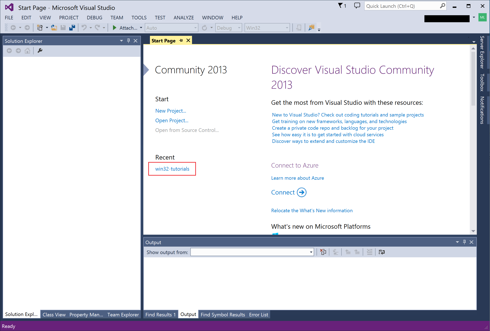

---

On the left pane, you should have the solution explorer.

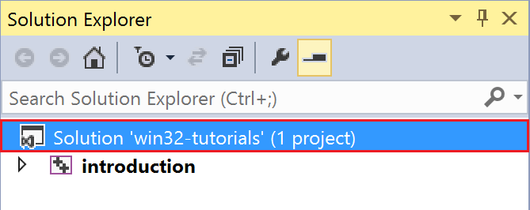

---

Right-click on the solution and add a new project.

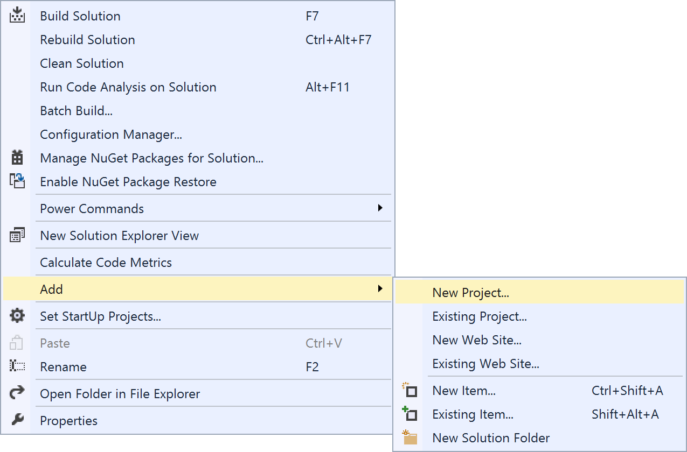

---

Select **Win32 Project** and change it's name to _MyFirstWindow_.

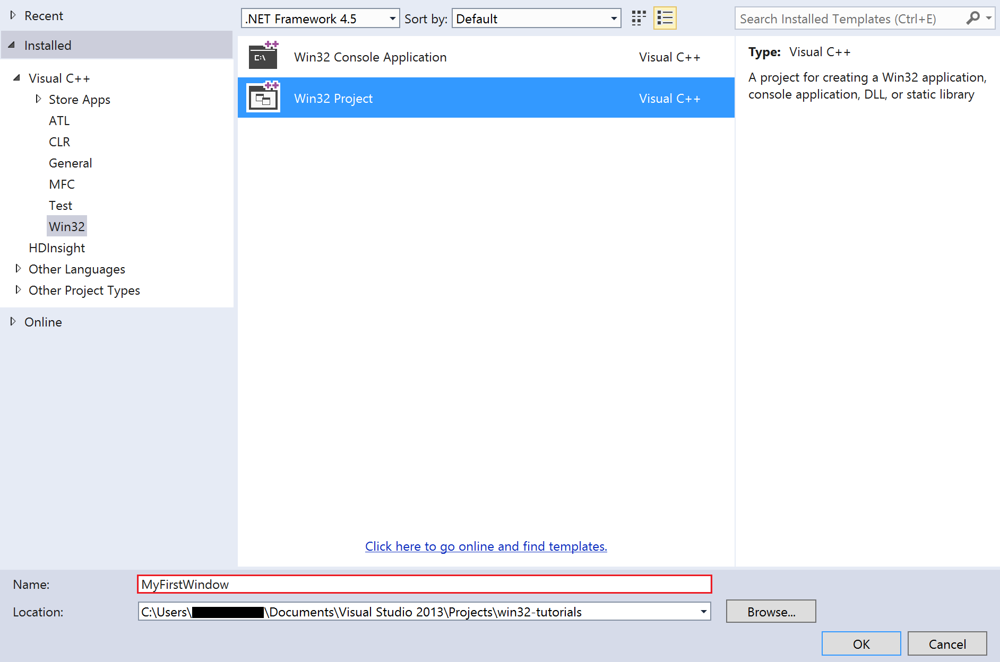


Once you are done, simply click OK. The **Win32 project wizard** will launch to help you [setup your new project](#win32-project-wizard).

---

####Approach \#2

---

##Start a new project

Go to the menu bar and select new project.

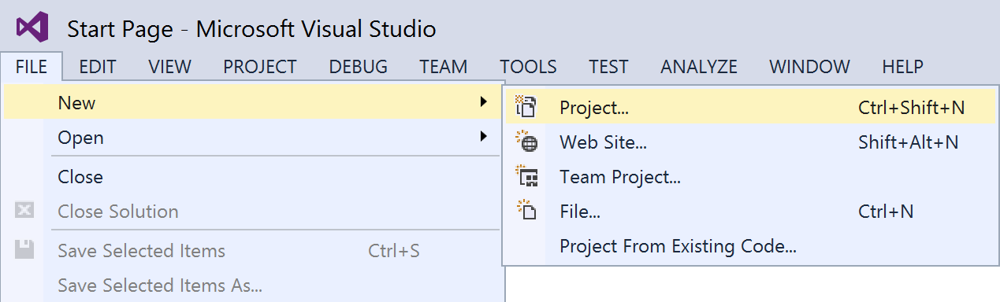

---

You will be prompted to choose a project type. Select _Win32 Project_.

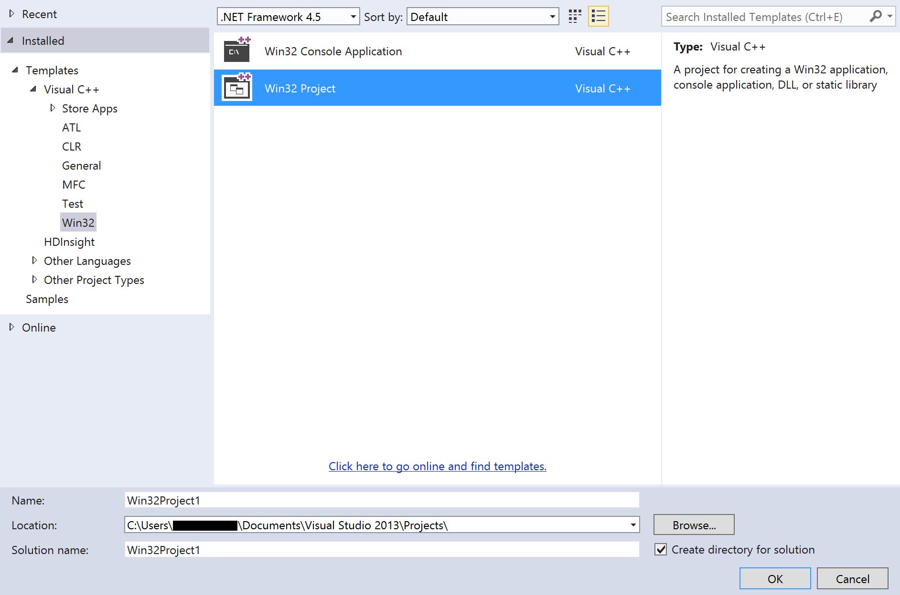

If you wish, you can choose a different project name than _Win32Project1_. I will use _MyFirstWindow_ for clarity purposes.

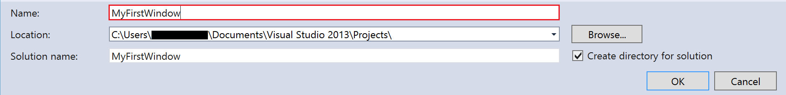

Once you are done, simply click OK. The Win32 project wizard will launch to help you [setup your new project](#win32-project-wizard).

---

##Win32 project wizard

In the **Win32 project wizard**, simply click _Next_.

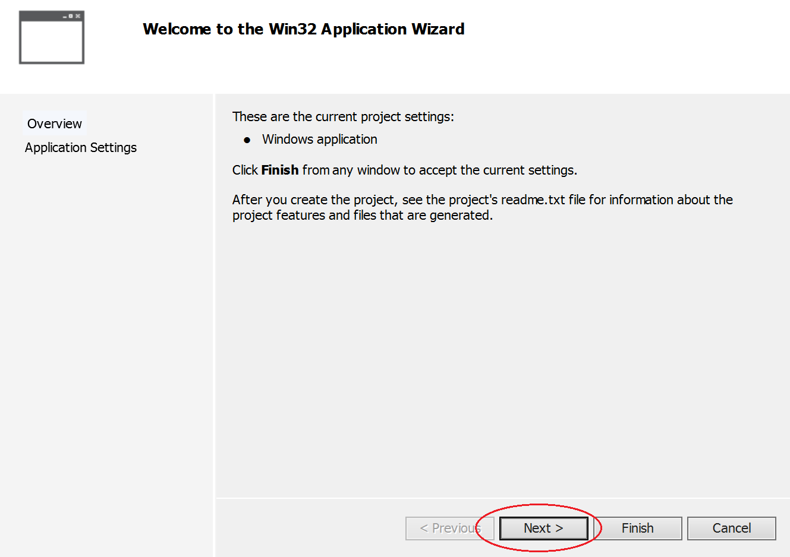

After this comes the application settings, where you choose whether or not you may want to start from a particular template. Since the purpose of this tutorial is to create a window from scratch, we do not need a template, but rather an empty project. In **Additional options**, check **Empty project **, then click _OK_.

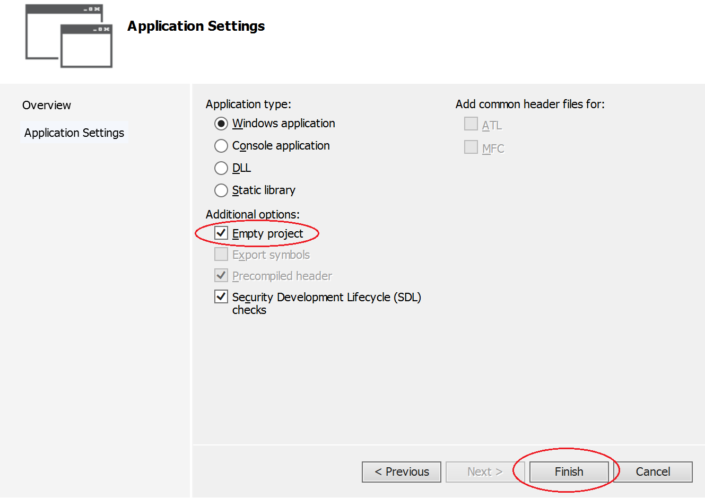

---

##Source files

In the solution explorer, expand the project to see it's content, by clicking on the arrow.
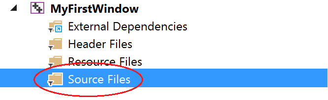

Right-click **Source Files** and add a new item.

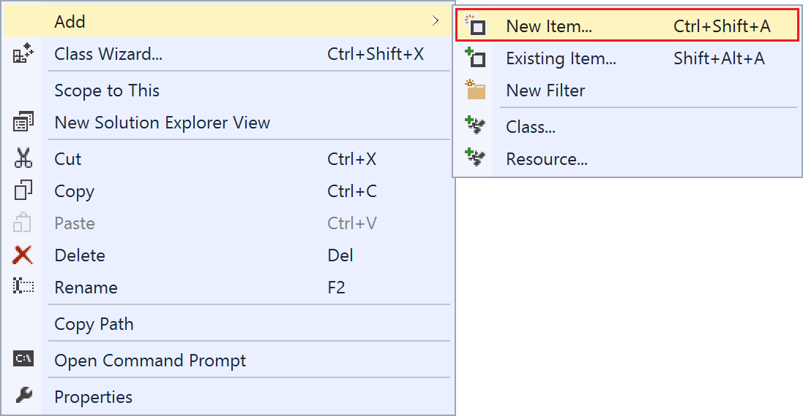


---

#The code

##Windows headers

In order to gain access to Win32 API functions, we need a file that references them. By convention, this is done by including **Windows.h**.

```c
#ifndef WIN32_LEAN_AND_MEAN
#define WIN32_LEAN_AND_MEAN
#endif
#include <Windows.h>
```

Macro _WIN32_LEAN_AND_MEAN_ is used to reduce unnecessary function parsing, as **Windows.h** contains several references to other rarely used includes.

---
In **Windows.h**  

```c
#ifndef WIN32_LEAN_AND_MEAN
#include <cderr.h>
#include <dde.h>
#include <ddeml.h>
#include <dlgs.h>
#ifndef _MAC
#include <lzexpand.h>
#include <mmsystem.h>
#include <nb30.h>
#include <rpc.h>
#endif
#include <shellapi.h>
#ifndef _MAC
#include <winperf.h>
#include <winsock.h>
#endif
#ifndef NOCRYPT
#include <wincrypt.h>
#include <winefs.h>
#include <winscard.h>
#endif

#ifndef NOGDI
#ifndef _MAC
#include <winspool.h>
#ifdef INC_OLE1
#include <ole.h>
#else
#include <ole2.h>
#endif /* !INC_OLE1 */
#endif /* !MAC */
#include <commdlg.h>
#endif /* !NOGDI */
#endif /* WIN32_LEAN_AND_MEAN */

```

---


##WinMain


###Entry point

Unlike console applications, Win32 applications need to use a specific function named _WinMain_. This serves as the program entry point.


_CALLBACK_ is a macro that serves as an alias for [__stdcall](https://msdn.microsoft.com/en-us/library/zxk0tw93.aspx), an exclusive Windows [calling convention](http://en.wikipedia.org/wiki/Calling_convention).

```c
int CALLBACK WinMain(
  _In_ HINSTANCE hInstance,
  _In_ HINSTANCE hPrevInstance,
  _In_ LPSTR     lpCmdLine,
  _In_ int       nCmdShow
);
```


|Parameter|Description|
|:--|:--|
|hInstance|A handle to the current application instance.|
|hPrevInstance|A handle to a previous application instance. This only occurs if the current application is the nth instance higher than one. |
|lpCmdLine|The command line arguments, if any exist.|
|nCmdShow|Specifies the way the window will be shown. .i.e: minimized, maximized|

###Setup window class parameters
```c
// Setup window class attributes.
WNDCLASSEX wcex;
ZeroMemory(&wcex, sizeof(wcex));

wcex.cbSize			= sizeof(wcex);	// WNDCLASSEX size in bytes
wcex.style			= CS_HREDRAW | CS_VREDRAW;		// Window class styles
wcex.lpszClassName	= TEXT("MYFIRSTWINDOWCLASS");	// Window class name
wcex.hbrBackground	= (HBRUSH)(COLOR_WINDOW + 1);	// Window background brush color.
wcex.hCursor		= LoadCursor(hInstance, IDC_ARROW); // Window cursor
wcex.lpfnWndProc	= WndProc;		// Window procedure associated to this window
```

At first, we must declare a [WNDCLASSEX](https://msdn.microsoft.com/en-us/library/windows/desktop/ms633577%28v=vs.85%29.aspx) instance. This instance will represent the window class.

Since filling all attributes is not required to register a basic window class, we will first set all attributes to _zero_ and only initialize those that are needed.

> ***Note***:  
> Assumptions are made that the reader understands both
> reasons and motivations behind clearing values upon
> initialization, as C++ assigns arbitrary values to
> uninitialized data types. Class registration may fail
> if instance contains invalid values. More precisely,
> values that are outside the function's input range.

_ZeroMemory_ is a macro used to clear the [WNDCLASSEX](https://msdn.microsoft.com/en-us/library/windows/desktop/ms633577%28v=vs.85%29.aspx) instance, _wcex_ with [NULL](http://en.wikipedia.org/wiki/Null_pointer) values.

Precisely, _ZeroMemory_ is defined as:

```c
#define ZeroMemory(Destination,Length) memset((Destination),0,(Length))
```

As for the window attributes, here are the main attributes we will be using.

|Attribute|Description|
|:--|:--|
|_wcex.cbSize_|The size in bytes of the [WNDCLASSEX](https://msdn.microsoft.com/en-us/library/windows/desktop/ms633577%28v=vs.85%29.aspx) structure|
|_wcex.style_|The window class style. This is a combination of one or more [Window Class Styles](https://msdn.microsoft.com/en-us/library/windows/desktop/ff729176%28v=vs.85%29.aspx)|
|wcex.lpszClassName|A unique class name for the window. This class name is used by several functions to retrieve window information at run time.|
|wcex.hdrBackground|A brush handle representing the background color.|
|wcex.lpfnWndProc|A pointer to a window procedure function. This function is used for message processing. |


###Window class registration

After setting attributes, a window class must be registered before it can be used. To register a class, we use [RegisterClassEx](https://msdn.microsoft.com/en-us/library/windows/desktop/ms633587%28v=vs.85%29.aspx). It is important to note that each window class must be unique, as such attempting to register an already registered class or system class will result in failure.

```c
// Register window and ensure registration success.
if (!RegisterClassEx(&wcex))
	return 1;
```

###Setup window initialization parameters

Once registration complete, we need to specify how to display the window, it's style; dimensions; title; class name;

```c
	// Setup window initialization attributes.
	CREATESTRUCT cs;
	ZeroMemory(&cs, sizeof(cs));

	cs.x			= 0;	// Window X position
	cs.y			= 0;	// Window Y position
	cs.cx			= 640;	// Window width
	cs.cy			= 480;	// Window height
	cs.hInstance	= hInstance; // Window instance.
	cs.lpszClass	= wcex.lpszClassName;		// Window class name
	cs.lpszName		= TEXT("My First Window");	// Window title
	cs.style		= WS_OVERLAPPEDWINDOW;		// Window style
```

We need a [CREATESTRUCT](https://msdn.microsoft.com/en-us/library/windows/desktop/ms632603%28v=vs.85%29.aspx) instance to specify these properties.

|Attribute|Description|
|:--|:--|
|_cs.x_|The left position of the window|
|_cs.y_|The top position of the window|
|_cs.cx_|The width of the window|
|_cs.cy_|The height of the window|
|_cs.hInstance_|The application instance to which, this window is associated|
|_cs.lpszClassName_|The window's class name. This is the type of window to be created. We use the one we created, previously.|
|_cs.lpszName_|The window's name or title, precisely.|
|_cs.style_|The window's style. The style is a combination of one or more window styles. For a complete list of styles, readers should refer to [Window Styles](https://msdn.microsoft.com/en-us/library/windows/desktop/ms632600(v=vs.85).aspx) |

###Window creation

To create a window, we need to use the function [CreateWindowEx](https://msdn.microsoft.com/en-us/library/windows/desktop/ms632680%28v=vs.85%29.aspx). While we can directly assign values in function arguments, as seen in [Introduction](../introduction/introduction.md), the reason behind using [CREATESTRUCT](https://msdn.microsoft.com/en-us/library/windows/desktop/ms632603%28v=vs.85%29.aspx) is to demonstrate the relation between this function and this structure.

```c
// Create the window.
HWND hWnd = ::CreateWindowEx(
	cs.dwExStyle,
	cs.lpszClass,
	cs.lpszName,
	cs.style,
	cs.x,
	cs.y,
	cs.cx,
	cs.cy,
	cs.hwndParent,
	cs.hMenu,
	cs.hInstance,
	cs.lpCreateParams);
```


###Display the window

To display the window, we need to call [ShowWindow](https://msdn.microsoft.com/en-us/library/windows/desktop/ms633548%28v=vs.85%29.aspx) with argument _nCmdShow_ as _SW_SHOWDEFAULT_. _nCmdShow_ specifies how the window will open, we could specify _SW_MAXIMIZE_ to make the window maximized, _SW_MINIMIZE_ for minimization. Since we simply want to illustrate the main use of [ShowWindow](https://msdn.microsoft.com/en-us/library/windows/desktop/ms633548%28v=vs.85%29.aspx), _SW_SHOWDEFAULT_ is used as the default argument.

The next function, [UpdateWindow](https://msdn.microsoft.com/en-us/library/windows/desktop/dd145167%28v=vs.85%29.aspx), is used to send a paint message, [WM_PAINT](https://msdn.microsoft.com/en-us/library/windows/desktop/dd145213%28v=vs.85%29.aspx), to the window, to ensure the window gets redrawn at least once, after being displayed. It is usually a good convention to call [UpdateWindow](https://msdn.microsoft.com/en-us/library/windows/desktop/dd145167%28v=vs.85%29.aspx) after [ShowWindow](https://msdn.microsoft.com/en-us/library/windows/desktop/ms633548%28v=vs.85%29.aspx) or any other operations involved on client area modification/display.

```c
// Display the window.
::ShowWindow(hWnd, SW_SHOWDEFAULT);
::UpdateWindow(hWnd);
```


###The message loop

The message loop is fairly simple, As stated in [Windows and messages](../windows-and-messages/windows-and-messages.md), the system checks in the message queue to see if there are pending messages. If any message is found, then the system will dispatch it to the appropriate window. Here is a simplified version of the main loop with no [TranslateAccelerator](https://msdn.microsoft.com/en-us/library/windows/desktop/ms646373%28v=vs.85%29.aspx) or [TranslateMessage](https://msdn.microsoft.com/en-us/library/windows/desktop/ms644955%28v=vs.85%29.aspx).

####_GetMessage_

The [GetMessage](https://msdn.microsoft.com/en-ca/library/windows/desktop/ms644936%28v=vs.85%29.aspx) function is used to retrieve pending messages from the main message queue.

```c
BOOL WINAPI GetMessage(
  _Out_    LPMSG lpMsg,
  _In_opt_ HWND  hWnd,
  _In_     UINT  wMsgFilterMin,
  _In_     UINT  wMsgFilterMax
);
```

|Parameter|Description|
|:--|:--|
| _lpMsg_ | A pointer to a [MSG](https://msdn.microsoft.com/en-us/library/windows/desktop/ms644958%28v=vs.85%29.aspx) structure, to store information about message queues associated to the current window.|
| _hWnd_ | A window handle to retrieve messages from. In this case, it is our previously created window. |
| wMsgFilterMin | The minimal message value to be retrieved. |
| wMsgFilterMax | The maximal message value to be retrieved. |


####_DispatchMessage_

The dispatch function is used to dispatch the message that was received to the associated window.

```c
LRESULT WINAPI DispatchMessage(
  _In_ const MSG *lpmsg
);
```

####Putting it all together

```c
// Main message loop.
MSG msg;
while (::GetMessage(&msg, hWnd, 0, 0) > 0)
	::DispatchMessage(&msg);

```

One particular difference with this version and the one seen previously is the conditional expression within while loop. The expression returns true when [GetMessage](https://msdn.microsoft.com/en-ca/library/windows/desktop/ms644936%28v=vs.85%29.aspx) _>_ _0_. The reason behind using > 0 comes from the fact that if [GetMessage](https://msdn.microsoft.com/en-ca/library/windows/desktop/ms644936%28v=vs.85%29.aspx) encounters an error, the result is negative. This to ensure that the loop will be able to terminate. I will describe error handling in further tutorials, as Win32 errors and exceptions are not part of this tutorial.

###Unregister window class

This is an optional function call, which consists of unregistering the windows class we created when we no longer need it. [UnregisterClass](https://msdn.microsoft.com/en-us/library/windows/desktop/ms644899%28v=vs.85%29.aspx) checks if a window class, specified by _wcex.lpszClassName_, already exists and frees memory that was allocated for this one.

```c
// Unregister window class, freeing the memory that was
// previously allocated for this window.
::UnregisterClass(wcex.lpszClassName, hInstance);
```

By default, application defined classes are automatically unregistered when the process terminates, therefore making this line a bit redundant. Nevertheless, it does not mean it should never be used. There might be situations where an application has a special window that is only available when a specific option is enabled. The window is registered before use and unregistered in order to free memory, since this class is unique and only has utility when visible.


##Window procedure

The last function to implement is the window procedure. A general naming convention for the default procedure is [WndProc](https://msdn.microsoft.com/en-us/library/windows/desktop/ms633573%28v=vs.85%29.aspx). If you want, you can use a different name, additionally, you need to ensure that the function used in the [WNDCLASSEX](https://msdn.microsoft.com/en-us/library/windows/desktop/ms633577%28v=vs.85%29.aspx), _wcex.lpfnWndProc_ matches both signature and name of your function.


```c

LRESULT CALLBACK WndProc(HWND hWnd, UINT uMsg, WPARAM wParam, LPARAM lParam)
{
	switch (uMsg)
	{
	case WM_DESTROY:
		::PostQuitMessage(0);
		break;
	default:
		return ::DefWindowProc(hWnd, uMsg, wParam, lParam);
	}

	return 0;
}

```

|Parameter|Description|
|:--|:--|
|_hWnd_|A handle representing the window that is currently being processed.|
|_uMsg_|the message ID that was dispatched in main loop.|
|_wParam_|A parameter whose value may change based on _uMsg_ value.|
|_lParam_|A parameter whose value may change based on _uMsg_ value.|

If no message is handled, the default case will simply call the default window procedure to process all messages that were not processed by [Wndproc](https://msdn.microsoft.com/en-us/library/windows/desktop/ms633573%28v=vs.85%29.aspx).

In order to be able to return from the main loop, a request is needed to let the main thread know that the application is terminating. This is the reason for using [PostQuitMessage](https://msdn.microsoft.com/en-us/library/windows/desktop/ms644945%28v=vs.85%29.aspx). This function takes an integer which is used as an exit code, then sends a [WM_QUIT](https://msdn.microsoft.com/en-us/library/windows/desktop/ms632641(v=vs.85).aspx) message to the thread's message queue. When [GetMessage](https://msdn.microsoft.com/en-ca/library/windows/desktop/ms644936%28v=vs.85%29.aspx) retrieves the quit message, and places the exit code value in the [MSG](https://msdn.microsoft.com/en-us/library/windows/desktop/ms644958%28v=vs.85%29.aspx) structure, ends the message loop. The return value of the application can be retrieved from the _wParam_, from [MSG](https://msdn.microsoft.com/en-us/library/windows/desktop/ms644958%28v=vs.85%29.aspx) and used as the  return value in [WinMain](https://msdn.microsoft.com/en-us/library/windows/desktop/ms633559%28v=vs.85%29.aspx).

```c
return (int)msg.wParam;
```

##Building and launching the project

When you have multiple projects in one workspace, and are willing to automatically start building from a specific project, you need to set it as the default startup project.

To set a startup project, in solution explorer, right-click on the desired project, _MyFirstWindow_ in this case, and select **Set as StartUp Project**.

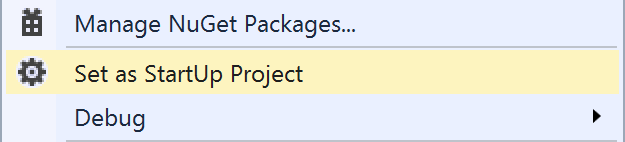

Then click the green arrow button, **Local Windows Debugger**, or press **Ctrl+F5**.


The result should be similar to the following:


---

##Conclusion

Readers should be able to setup, register, initialize, create a window from scratch, without the need of a template. Readers should now be familiar with the basics of  [event-driven architecture](http://en.wikipedia.org/wiki/Event-driven_architecture), as well as a comprehension of the window and the procedure, to which is associated. Finally, readers are expected to have acquired new techniques and skills in [Visual Studio](https://www.visualstudio.com/), which will be used in future tutorials. For future tutorials, readers should be comfortable with the creation of new projects if necessary, as well as building, and adding new source files and items to them.

Readers are encouraged to read this tutorial again to ensure correct understanding, as further tutorials will cover and expand concepts viewed throughout this lecture.

---

##Complete example

```c
#ifndef WIN32_LEAN_AND_MEAN
#define WIN32_LEAN_AND_MEAN
#endif
#include <Windows.h>

//
//
// WndProc - Window procedure
//
//
LRESULT
CALLBACK
WndProc(HWND hWnd, UINT uMsg, WPARAM wParam, LPARAM lParam)
{
	switch (uMsg)
	{
	case WM_DESTROY:
		::PostQuitMessage(0);
		break;
	default:
		return ::DefWindowProc(hWnd, uMsg, wParam, lParam);
	}

	return 0;
}

//
//
// WinMain - Win32 application entry point.
//
//
int
APIENTRY
wWinMain(
	HINSTANCE hInstance,
	HINSTANCE hPrevInstance,
	LPWSTR lpCmdLine,
	int nShowCmd)
{
	// Setup window class attributes.
	WNDCLASSEX wcex;
	ZeroMemory(&wcex, sizeof(wcex));

	wcex.cbSize			= sizeof(wcex);	// WNDCLASSEX size in bytes
	wcex.style			= CS_HREDRAW | CS_VREDRAW;		// Window class styles
	wcex.lpszClassName	= TEXT("MYFIRSTWINDOWCLASS");	// Window class name
	wcex.hbrBackground	= (HBRUSH)(COLOR_WINDOW + 1);	// Window background brush color.
	wcex.hCursor		= LoadCursor(hInstance, IDC_ARROW); // Window cursor
	wcex.lpfnWndProc	= WndProc;		// Window procedure associated to this window class.
	wcex.hInstance		= hInstance;	// The application instance.

	// Register window and ensure registration success.
	if (!RegisterClassEx(&wcex))
		return 1;

	// Setup window initialization attributes.
	CREATESTRUCT cs;
	ZeroMemory(&cs, sizeof(cs));

	cs.x			= 0;	// Window X position
	cs.y			= 0;	// Window Y position
	cs.cx			= 640;	// Window width
	cs.cy			= 480;	// Window height
	cs.hInstance	= hInstance; // Window instance.
	cs.lpszClass	= wcex.lpszClassName;		// Window class name
	cs.lpszName		= TEXT("My First Window");	// Window title
	cs.style		= WS_OVERLAPPEDWINDOW;		// Window style

	// Create the window.
	HWND hWnd = ::CreateWindowEx(
		cs.dwExStyle,
		cs.lpszClass,
		cs.lpszName,
		cs.style,
		cs.x,
		cs.y,
		cs.cx,
		cs.cy,
		cs.hwndParent,
		cs.hMenu,
		cs.hInstance,
		cs.lpCreateParams);

	// Validate window.
	if (!hWnd)
		return 1;

	// Display the window.
	::ShowWindow(hWnd, SW_SHOWDEFAULT);
	::UpdateWindow(hWnd);

	// Main message loop.
	MSG msg;
	while (::GetMessage(&msg, hWnd, 0, 0) > 0)
		::DispatchMessage(&msg);

	// Unregister window class, freeing the memory that was
	// previously allocated for this window.
	::UnregisterClass(wcex.lpszClassName, hInstance);

	return (int)msg.wParam;
}
```

---

[Previous](../windows-and-messages/windows-and-messages.md) | [Index](../../index.md) | [Next](../resources/resources.md)
