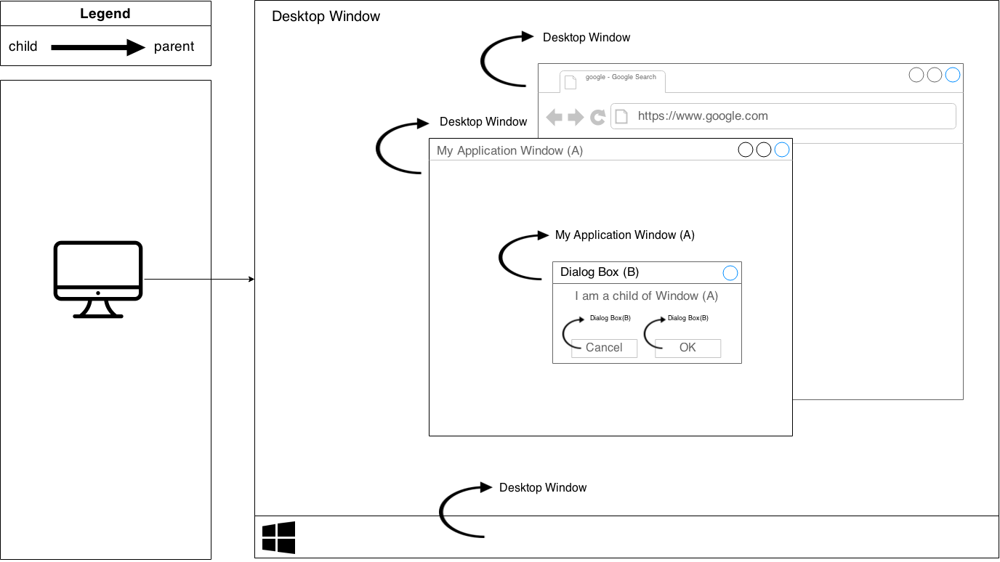
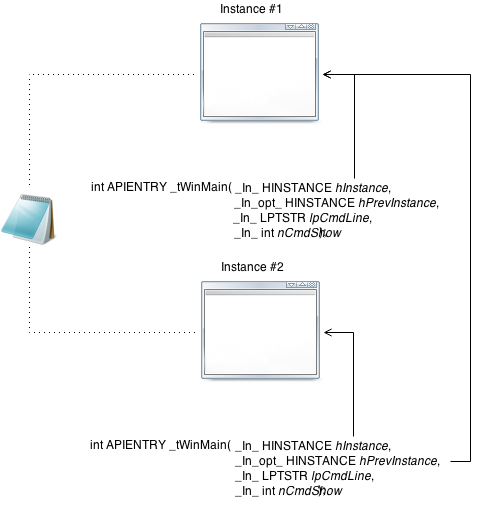
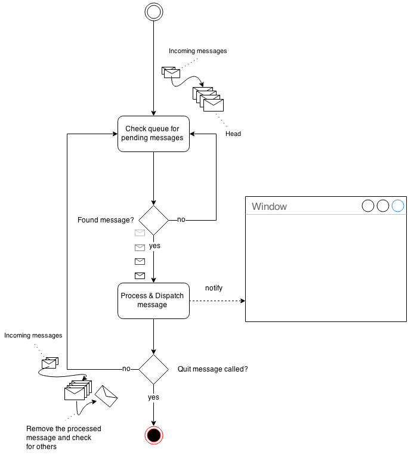

# Windows and messages

##Purpose

The purpose of this tutorial is to take a deeper look at the _WinMain_ function in order to understand how structured a **Win32** application is. By the end of this tutorial, readers should be able to understand the concepts of message queues, window registration & creation, as well as the base of message loop and how all these operate to make an application work.

##Intended audience

This tutorial requires basic knowledge of [Visual Studio](https://www.visualstudio.com/). It is recommended to have read [Introduction](../introduction/introduction.md)  before proceeding. As stated in previous tutorials, readers should be proficient in C/C++, as this tutorial does not cover the [C++ programming language](http://en.wikipedia.org/wiki/C%2B%2B).


##Objectives

* _Demestify the main function._
* _Window registration & creation analysis._  
* _Understanding the message loop._
* _Analyzing window procedure._

##Table of content

1. [Windows graphical environment](#windows-graphical-environment)
* [An overview of WinMain](#an-overview-of-winmain)
* [Window initialization](#window-initialization)
  1. [Window registration](#window-registration)
  * [Window creation](#window-creation)
* [Accelerator table](#accelerator-table)
* [The message loop](#the-message-loop)
* [The window procedure](#the-window-procedure)
* [Conclusion](#conclusion)

---

#Windows graphical environment

In the [windows graphical environment](http://en.wikipedia.org/wiki/Graphical_user_interface), everything is a [window](http://en.wikipedia.org/wiki/Window_(computing)). Even the desktop area is part of a window. This window is more precisely known as the [desktop window](http://en.wikipedia.org/wiki/Desktop_Window_Manager). Everytime you run an application that displays one or more windows, all of it's windows become children of the desktop window.

---



---

#An overview of WinMain

##Declaration

This is the main function. Let's analyze it's [type signature](http://en.wikipedia.org/wiki/Type_signature)

```c
int APIENTRY _tWinMain(
  _In_ HINSTANCE hInstance,
  _In_ HINSTANCE hPrevInstance,
  _In_ LPTSTR     lpCmdLine,
  _In_ int       nCmdShow
);
```

The first parameter, _hInstance_, represents the actual [instance](http://en.wikipedia.org/wiki/Instance_%28computer_science%29) of an application.  

The second paramter, _hPrevInstance_, is a handle to a previous [instance](http://en.wikipedia.org/wiki/Instance_%28computer_science%29), (such instance only exists if there is an already running application of the same application).  

Third parameter, _lpCmdLine_, represents the [command-line](http://en.wikipedia.org/wiki/Command-line_interface) [arguments](http://en.wikipedia.org/wiki/Command-line_interface#Arguments).  

Finally, _nCmdShow_ is a value that tells how the window should be displayed. For example, if the the display is set to be minimized, this value will be 2. If the window needs to show as maximized, this value will be 3, etc.

Here is a schematic that demonstrates the main differences between _hInstance_ and _hPrevInstance_.  



##Definition

Then, comes the definition of _WinMain_.

```c

int APIENTRY _tWinMain(_In_ HINSTANCE hInstance,
                     _In_opt_ HINSTANCE hPrevInstance,
                     _In_ LPTSTR    lpCmdLine,
                     _In_ int       nCmdShow)
{
	UNREFERENCED_PARAMETER(hPrevInstance);
	UNREFERENCED_PARAMETER(lpCmdLine);

 	// TODO: Place code here.
	MSG msg;
	HACCEL hAccelTable;

	// Initialize global strings
	LoadString(hInstance, IDS_APP_TITLE, szTitle, MAX_LOADSTRING);
	LoadString(hInstance, IDC_INTRODUCTION, szWindowClass, MAX_LOADSTRING);
	MyRegisterClass(hInstance);

	// Perform application initialization:
	if (!InitInstance (hInstance, nCmdShow))
	{
		return FALSE;
	}

	hAccelTable = LoadAccelerators(hInstance, MAKEINTRESOURCE(IDC_INTRODUCTION));

	// Main message loop:
	while (GetMessage(&msg, NULL, 0, 0))
	{
		if (!TranslateAccelerator(msg.hwnd, hAccelTable, &msg))
		{
			TranslateMessage(&msg);
			DispatchMessage(&msg);
		}
	}

	return (int) msg.wParam;
}

```

I believe you are currently asking yourself, "Should I have to memorize all this?", "Is it the hello-world program at it's simplest form?". Simply calm down. This really is not the minimalist hello-world program. By default, when you choose to start from a Win32 application template, it will create various resources such as dialogs, and string tables.

Let us begin with the two first lines.

```c
UNREFERENCED_PARAMETER(hPrevInstance);
UNREFERENCED_PARAMETER(lpCmdLine);
```

_UNREFERENCED_PARAMETER_ is a simple [macro](http://en.wikipedia.org/wiki/Macro_(computer_science)) to prevent the [compiler](http://en.wikipedia.org/wiki/Compiler) from generating warnings, due to [unused variables](http://en.wikipedia.org/wiki/Unreferenced_variable). Since an application does not need to specify [command-line arguments](http://en.wikipedia.org/wiki/Command-line_interface#Arguments) (_lpCmdLine_) or ways to show the window (_nCmdShow_), these variables may or not be used, thus, unreferenced, which leads to a minor/harmless memory waste.

---

The next two lines, are simple [declarations](http://en.wikipedia.org/wiki/Declaration_(computer_programming)). Their use will be explained later throughout this tutorial.

```c
MSG msg;
HACCEL hAccelTable;
```

---

Always in _WinMain_, these next three functions.

```c
LoadString(hInstance, IDS_APP_TITLE, szTitle, MAX_LOADSTRING);
LoadString(hInstance, IDC_INTRODUCTION, szWindowClass, MAX_LOADSTRING);
MyRegisterClass(hInstance);
```

[LoadString](https://msdn.microsoft.com/en-ca/library/windows/desktop/ms647486%28v=vs.85%29.aspx) is a function used to retrieve a string [resource](http://en.wikipedia.org/wiki/Resource_(computing)) from a specified instance. A [string](http://en.wikipedia.org/wiki/String_%28computer_science%29) [resource](http://en.wikipedia.org/wiki/Resource_(computing)) can represent language translation/window title/message box labels, etc. Once retrieved, the [string](http://en.wikipedia.org/wiki/String_%28computer_science%29) is copied to a destination buffer, _szTitle_ and _szWindowClass_ in this case.

_MyRegisterClass_ is a template defined function that registers the class of the application. We will cover this function at the next step.

---

As for _InitInstance_, this template defined  function is simply used to create and initialize the window.

```c
if (!InitInstance (hInstance, nCmdShow))
{
  return FALSE;
}
```

---

The function [LoadAccelerators](https://msdn.microsoft.com/en-us/library/windows/desktop/ms646370(v=vs.85).aspx) is used to retrieve a [keyboard accelerator](https://msdn.microsoft.com/en-us/library/windows/desktop/ms645526(v=vs.85).aspx) from a resource file. I will not describe it's use here, as it will be covered in future tutorials.

```c
hAccelTable = LoadAccelerators(hInstance, MAKEINTRESOURCE(IDC_INTRODUCTION));
```

---

Finally, [the message loop](http://en.wikipedia.org/wiki/Message_loop_in_Microsoft_Windows).

```c
while (GetMessage(&msg, NULL, 0, 0))
{
  if (!TranslateAccelerator(msg.hwnd, hAccelTable, &msg))
  {
    TranslateMessage(&msg);
    DispatchMessage(&msg);
  }
}

return (int) msg.wParam;

```

The message loop is responsible for dispatching messages from the message queue to the appropriate window, as Win32 API uses an [event-driven](http://en.wikipedia.org/wiki/Event-driven_programming) architecture. The application's [exit code](http://en.wikipedia.org/wiki/Exit_status) is stored in a structure [MSG](https://msdn.microsoft.com/en-us/library/windows/desktop/ms644958(v=vs.85).aspx) and returned.

---

#Window initialization

##Window registration


Before a window can be created, it needs to be registered in order to be identified during [run time](http://en.wikipedia.org/wiki/Run_time_(program_lifecycle_phase)) by messages and events. In order to understand the registration process, let's head to _MyRegisterClass_ definition.


```c

//
//  FUNCTION: MyRegisterClass()
//
//  PURPOSE: Registers the window class.
//
ATOM MyRegisterClass(HINSTANCE hInstance)
{
	WNDCLASSEX wcex;

	wcex.cbSize = sizeof(WNDCLASSEX);

	wcex.style			= CS_HREDRAW | CS_VREDRAW;
	wcex.lpfnWndProc	  = WndProc;
	wcex.cbClsExtra	   = 0;
	wcex.cbWndExtra	   = 0;
	wcex.hInstance	    = hInstance;
	wcex.hIcon			= LoadIcon(hInstance, MAKEINTRESOURCE(IDI_INTRODUCTION));
	wcex.hCursor		  = LoadCursor(NULL, IDC_ARROW);
	wcex.hbrBackground	= (HBRUSH)(COLOR_WINDOW+1);
	wcex.lpszMenuName	 = MAKEINTRESOURCE(IDC_INTRODUCTION);
	wcex.lpszClassName	= szWindowClass;
	wcex.hIconSm		  = LoadIcon(wcex.hInstance, MAKEINTRESOURCE(IDI_SMALL));

	return RegisterClassEx(&wcex);
}

```

To register a window, we must begin by defining the window class [attributes](http://en.wikipedia.org/wiki/Attribute_(computing)). These are [attributes](http://en.wikipedia.org/wiki/Attribute_(computing)) to be shared by all windows that will use this kind of [class](http://en.wikipedia.org/wiki/Class_%28computer_programming%29). It is important to note that a window class **_must_** be **_unique_**.

###The WNDCLASSEX structure


```c

typedef struct tagWNDCLASSEXW {
    UINT        cbSize;
    /* Win 3.x*/
    UINT        style;
    WNDPROC     lpfnWndProc;
    int         cbClsExtra;
    int         cbWndExtra;
    HINSTANCE   hInstance;
    HICON       hIcon;
    HCURSOR     hCursor;
    HBRUSH      hbrBackground;
    LPCWSTR     lpszMenuName;
    LPCWSTR     lpszClassName;
    /* Win 4.0*/
    HICON       hIconSm;
} WNDCLASSEXW, *PWNDCLASSEXW, NEAR *NPWNDCLASSEXW, FAR *LPWNDCLASSEXW;

```

|Name|Description|
|:--|:--|
|`cbSize`|The size in bytes of `WNDCLASSEX`|
|`style`|The style of the window|
|`lpfnWndProc`|A pointer to a WNDPROC callback to use as a message listener|
|`cbClsExtra`|A set of additional flag values|
|`cbWndExtra`|A set of additional flag values|
|`hInstance`|A handle to the current application instance|
|`hIcon`|A handle to an icon|
|`hCursor`|A handle to a cursor|
|`hbrBackground`|A handle to a brush color|
|`lpszMenuName`|The Menu name|
|`lpszClassName`|This window's class name|

---

> ***Reminder***
>
> Windows Data types
>
> |Name|Definition|
> |:--|:--|
> |LPSTR|`typedef char* LPSTR`|
> |LPCSTR|`typedef const char* LPCSTR`|
> |LPWSTR|`typedef wchar_t* LPWSTR`|
> |LPCWSTR|`typedef const wchar_t* LPCWSTR`|
> |PVOID|`typedef void* PVOID`|
> |HANDLE|`typedef PVOID HANDLE`|
> |HINSTANCE|`typedef HANDLE HINSTANCE`|
>
>

###RegisterClassEx

```c
return RegisterClassEx(&wcex);
```

[RegisterClassEx](https://msdn.microsoft.com/en-us/library/windows/desktop/ms633587(v=vs.85).aspx) is a function that takes a pointer to a [WNDCLASSEX](https://msdn.microsoft.com/en-us/library/windows/desktop/ms633577(v=vs.85).aspx) structure and returns a unique identifier for the window. If the function fails, the return value is zero.


#####Reasons why RegisterClassEx would not work

* _cbSize_ is not specified or improperly initialized. The recommended way is to set _cbSize_ to _sizeof(WNDCLASSEX)_.
* _lpszClassName_ is already registered, and thus is causing a failure to avoid duplicate classes.
* _hInstance_ is not a valid application instance, or is uninitialized.
* _hbrBackground_ is an invalid [HANDLE](https://msdn.microsoft.com/en-us/library/windows/desktop/aa383751%28v=vs.85%29.aspx#HANDLE) value. The default value is _COLOR_WINDOW+1_.


##Window creation

After the window registration, the window needs to be created. Let us proceed to the function _InitInstance_.

```c

//
//   FUNCTION: InitInstance(HINSTANCE, int)
//
//   PURPOSE: Saves instance handle and creates main window
//
//   COMMENTS:
//
//        In this function, we save the instance handle in a global variable and
//        create and display the main program window.
//
BOOL InitInstance(HINSTANCE hInstance, int nCmdShow)
{
   HWND hWnd;

   hInst = hInstance; // Store instance handle in our global variable

   hWnd = CreateWindow(szWindowClass, szTitle, WS_OVERLAPPEDWINDOW,
      CW_USEDEFAULT, 0, CW_USEDEFAULT, 0, NULL, NULL, hInstance, NULL);

   if (!hWnd)
   {
      return FALSE;
   }

   ShowWindow(hWnd, nCmdShow);
   UpdateWindow(hWnd);

   return TRUE;
}
```


This variable _hWnd_, is a handle to our main window. it is initialized by [CreateWindow](https://msdn.microsoft.com/en-us/library/windows/desktop/ms632679(v=vs.85).aspx) , which is used to create a window of a particular style at a given position. If a window parent is specified, the newly created window will become a child of the parent.

All present parameters in [CreateWindow](https://msdn.microsoft.com/en-us/library/windows/desktop/ms632679(v=vs.85).aspx) are the same as those found in [CREATESTRUCT](https://msdn.microsoft.com/en-us/library/windows/desktop/ms632603(v=vs.85).aspx).  
Here is a closer look at this particular structure.

###The CreateStruct Structure

```c
typedef struct tagCREATESTRUCTA {
    LPVOID      lpCreateParams;
    HINSTANCE   hInstance;
    HMENU       hMenu;
    HWND        hwndParent;
    int         cy;
    int         cx;
    int         y;
    int         x;
    LONG        style;
    LPCSTR      lpszName;
    LPCSTR      lpszClass;
    DWORD       dwExStyle;
} CREATESTRUCTA, *LPCREATESTRUCTA;
```

|Name|Description|
|:--|:--|
|_lpCreateParams_|An argument that can be passed for further use in the _WndProc_ function|
|_hInstance_|The instance of the associated application|
|_hMenu_|A handle to a menu|
|_hwndParent_|A handle to a window to use as parent|
|_cy_|The height of the window|
|_cx_|The width of the window|
|_x_|The left position of the window|
|_y_|The top position of the window|
|_style_|The style of the window|
|_lpszName_|The name of the window (title)|
|_lpszClass_|The window's class name. This must match _wcex.lpszClassName_ in _WNDCLASSEX_|
|_dwExStyle_|An extended window style - **Unused in this example!**|


#Accelerator table

This instruction is used to load an accelerator table from a resource file.

```c

hAccelTable = LoadAccelerators(hInstance, MAKEINTRESOURCE(IDC_INTRODUCTION));

```

I will not explain in depth resource files, as resources will be explained in further tutorials, but for a quick overview: An accelerator table is used to bind keyboard combinations to application commands.

By default, template applications use automatically generated accelerator tables, but keep in mind that these are not required at all.


#The message loop

Now that the main window is created and setup, it is time to setup the main loop of our application, which will take care of processing messages and events. Before demonstrating the code, we will take a look at the concept of [sending and recieving events](http://en.wikipedia.org/wiki/Observer_pattern) in an [event-driven architecture](http://en.wikipedia.org/wiki/Event-driven_architecture).




To begin with, the system checks if there are pending messages in the [message queue](http://en.wikipedia.org/wiki/Message_queue). If such a condition is met, then the system translates and dispatches the message to the appropriate window, which is, in this case, our main window. Each window is given a procedure. This procedure is represented by _lpfnWndProc_ in the [WNDCLASSEX](https://msdn.microsoft.com/en-us/library/windows/desktop/ms633577(v=vs.85).aspx) structure. This procedure is called by with the window handle to which it is associated, the message type, and additionally, with up to two parameters, _wParam_, _lParam_. The window procedure is responsible for doing tasks, often based on the message type. If the message type is the quit message, the function will return with negative result, causing the message loop to end. If this message differs from quitting, then the system will return to the message queue to process the next message, or wait until it receives new notifications.


In order to process messages continuously, we need to create a loop. This loop, called the message loop. Here is the code from [WinMain](https://msdn.microsoft.com/en-us/library/windows/desktop/ms633559(v=vs.85).aspx).

```c

// Main message loop:
while (GetMessage(&msg, NULL, 0, 0))
{
  if (!TranslateAccelerator(msg.hwnd, hAccelTable, &msg))
	{
		TranslateMessage(&msg);
		DispatchMessage(&msg);
	}
}

```

####GetMessage

```c
BOOL WINAPI GetMessage(
  _Out_    LPMSG lpMsg,
  _In_opt_ HWND  hWnd,
  _In_     UINT  wMsgFilterMin,
  _In_     UINT  wMsgFilterMax
);
```

The _GetMessage_ function is used to retrieve pending messages in the message queue, waiting for a particular event to occur, such as mouse clicks, window resizing, focus loss, etc.


####TranslateAccelerator

```c
int WINAPI TranslateAccelerator(
  _In_ HWND   hWnd,
  _In_ HACCEL hAccTable,
  _In_ LPMSG  lpMsg
);
```


As it recieves a message, the function [TranslateAccelerator](https://msdn.microsoft.com/en-us/library/windows/desktop/ms646373(v=vs.85).aspx) is used to determine whether this message was triggered by an accelerator handle. If this is the case, then the accelerator will handle the message itself and redirect it to the proper commands.

####TranslateMessage

```c
BOOL WINAPI TranslateMessage(
  _In_ const MSG * lpMsg
  );
```


If the application needs to read from user input such as keyboard/mouse, The [TranslateMessage](https://msdn.microsoft.com/en-us/library/windows/desktop/ms644955(v=vs.85).aspx) function is used translate [virtual-key](https://msdn.microsoft.com/en-us/library/windows/desktop/dd375731%28v=vs.85%29.aspx) messages into character messages.

####DispatchMessage

```c
LRESULT WINAPI DispatchMessage(
  _In_ const MSG * lpmsg
);
```

This function, [DispatchMessage](https://msdn.microsoft.com/en-us/library/windows/desktop/ms644934(v=vs.85).aspx), is used to dispatch messages to a window procedure. In this case, the window procedure is represented by attribute _lpfnWndProc_ from [WNDCLASSEX](https://msdn.microsoft.com/en-us/library/windows/desktop/ms633577(v=vs.85).aspx), _WndProc_.

##The window procedure

This is the window procedure, which is called when a particular event is sent this window. To begin with, let us have a look at the function's declaration and parameters.

```c
LRESULT CALLBACK WindowProc(
 HWND hwnd,
 UINT  message,
 WPARAM wParam,
 LPARAM lParam
);
```

|Name|Description|
|:--|:--|
|hwnd|A handle to the window itself|
|message|A system-defined message|
|wParam|A message parameter|
|lParam|A message parameter|


The first parameter, _hwnd_, represents the current window being processed. This is represented by _hwnd_ in the _InitWindow_.

The second parameter, _message_, is a system-defined message. This is used to determine the nature of the event, .i.e: Keyboard input, mouse input, window focus acquisition/loss, etc.

The remaining parameters _wParam_ & _lParam_ are message parameters that may contain data/values based on the current value of _message_, the message type.

Now it is time to examine the definition of _WndProc_, the window procedure function.


```c

//
//  FUNCTION: WndProc(HWND, UINT, WPARAM, LPARAM)
//
//  PURPOSE:  Processes messages for the main window.
//
//  WM_COMMAND	- process the application menu
//  WM_PAINT	- Paint the main window
//  WM_DESTROY	- post a quit message and return
//
//
LRESULT CALLBACK WndProc(HWND hWnd, UINT message, WPARAM wParam, LPARAM lParam)
{
	int wmId, wmEvent;
	PAINTSTRUCT ps;
	HDC hdc;

	switch (message)
	{
	case WM_COMMAND:
		wmId    = LOWORD(wParam);
		wmEvent = HIWORD(wParam);
		// Parse the menu selections:
		switch (wmId)
		{
		case IDM_ABOUT:
			DialogBox(hInst, MAKEINTRESOURCE(IDD_ABOUTBOX), hWnd, About);
			break;
		case IDM_EXIT:
			DestroyWindow(hWnd);
			break;
		default:
			return DefWindowProc(hWnd, message, wParam, lParam);
		}
		break;
	case WM_PAINT:
		hdc = BeginPaint(hWnd, &ps);
		// TODO: Add any drawing code here...
		EndPaint(hWnd, &ps);
		break;
	case WM_DESTROY:
		PostQuitMessage(0);
		break;
	default:
		return DefWindowProc(hWnd, message, wParam, lParam);
	}
	return 0;
}

```

At a first look, this function looks confusing, but it is relatively simple to understand. As simplicity matters in these introductory tutorials, the definition of each case will be separated.

###WM_COMMAND

This message is sent whenever a user interaction occurs, such as menu item selection, or when a parent receives a notification from a child window.

```c
case WM_COMMAND:
  wmId    = LOWORD(wParam);
  wmEvent = HIWORD(wParam);
  // Parse the menu selections:
  switch (wmId)
  {
  case IDM_ABOUT:
    ...
  case IDM_EXIT:
    ...
  default:
    return DefWindowProc(hWnd, message, wParam, lParam);
  }
  break;
```

One important thing to note here is the use of macros [LOWORD](https://msdn.microsoft.com/en-us/library/windows/desktop/ms632659%28v=vs.85%29.aspx) & [HIWORD](https://msdn.microsoft.com/en-us/library/windows/desktop/ms632657(v=vs.85).aspx).

```c
wmId    = LOWORD(wParam);
wmEvent = HIWORD(wParam);
```

Before explaining the main purpose of both [macros](http://en.wikipedia.org/wiki/Macro_%28computer_science%29), we must comprehend what _wParam_ is. _wParam_ is a parameter of type _WPARAM_. The type _WPARAM_ is an [alias](http://en.wikipedia.org/wiki/Typedef) to a 32 bits unsigned integer. If targeting a 64 bits architecture, such as Windows x64, this will constitute an [alias](http://en.wikipedia.org/wiki/Typedef) to a 64 bits integer, which is equivalent to an _unsigned long long_, or _unsigned long long int_.

Assuming readers are familiar with binary representation, [LOWORD](https://msdn.microsoft.com/en-us/library/windows/desktop/ms632659%28v=vs.85%29.aspx) & [HIWORD](https://msdn.microsoft.com/en-us/library/windows/desktop/ms632657(v=vs.85).aspx) are [macros](http://en.wikipedia.org/wiki/Macro_%28computer_science%29) for retrieving specific bits of _wParam_. Using bitwise operators, the [LOWORD](https://msdn.microsoft.com/en-us/library/windows/desktop/ms632659%28v=vs.85%29.aspx) [macro](http://en.wikipedia.org/wiki/Macro_%28computer_science%29) can be seen as:

```c
#define LOWORD(l) ((WORD)(((DWORD_PTR)(l)) & 0xffff))
```

The [HIWORD](https://msdn.microsoft.com/en-us/library/windows/desktop/ms632657(v=vs.85).aspx) [macro](http://en.wikipedia.org/wiki/Macro_%28computer_science%29) is defined as:

```c
#define HIWORD(l) ((WORD)((((DWORD_PTR)(l)) >> 16) & 0xffff))
```

In short, _LOWORD_ simply performs [logical conjunction](http://en.wikipedia.org/wiki/Logical_conjunction) (AND) operation with value 0xffff which clears the upper 16 bits, leaving only the lower part unaffected.

[HIWORD](https://msdn.microsoft.com/en-us/library/windows/desktop/ms632657(v=vs.85).aspx), itself includes one extra before _LOWORD_: to use the right shift operators _>>_ to shift the upper part to the right, thus overriding the lower 16 bits, and then applying logical conjunction to clear the upper part.

**Note:** _We must ensure to clear the upper part again, otherwise it could result in improper values._


Once retrieved, this value will tell us the message ID, where prefixes such as _IDM_ are used as naming conventions to indicate that this represents a message ID. This leads us to an other conditional branch with two cases, _IDM_ABOUT_ and _IDM_EXIT_.


```c
case WM_COMMAND:
  wmId    = LOWORD(wParam);
  wmEvent = HIWORD(wParam);
  // Parse the menu selections:
  switch (wmId)
  {
  case IDM_ABOUT:
    ...
  case IDM_EXIT:
    ...
  default:
    return DefWindowProc(hWnd, message, wParam, lParam);
  }
  break;
```

####IDM_ABOUT

When users click the close button(X) at the top right corner, this causes the window to send a message [WM_COMMAND](https://msdn.microsoft.com/en-us/library/windows/desktop/ms647591(v=vs.85).aspx) with argument _IDM_ABOUT_ passed to _wParam_ as the low word (or low part), which is retrieved with [macro](http://en.wikipedia.org/wiki/Macro_%28computer_science%29) [LOWORD](https://msdn.microsoft.com/en-us/library/windows/desktop/ms632659%28v=vs.85%29.aspx). If the value corresponds to _IDM_ABOUT_, then _DialogBox_ is called and initialize a [dialog](http://en.wikipedia.org/wiki/Dialog_box) that displays information about the authors of the application. I will not explain how _DialogBox_ works for simplicity purposes. This will be covered in further tutorials.

```c
case IDM_ABOUT:
  DialogBox(hInst, MAKEINTRESOURCE(IDD_ABOUTBOX), hWnd, About);
  break;

```

####IDM_EXIT

When users click the close button(X) at the top right corner, this causes the window to send a message [WM_COMMAND](https://msdn.microsoft.com/en-us/library/windows/desktop/ms647591(v=vs.85).aspx) with argument _IDM_EXIT_ passed to _wParam_ as the low word (or low part), which is retrieved with macro [LOWORD](https://msdn.microsoft.com/en-us/library/windows/desktop/ms632659%28v=vs.85%29.aspx). If the value corresponds to _IDM_EXIT_, then the [DestroyWindow](https://msdn.microsoft.com/en-us/library/windows/desktop/ms632682(v=vs.85).aspx) function is called, which will then send a [WM_DESTROY](https://msdn.microsoft.com/en-us/library/windows/desktop/ms632620%28v=vs.85%29.aspx) message to the window, which we will see further in this tutorial.

```c
case IDM_EXIT:
  DestroyWindow(hWnd);
  break;
```

---

###WM_PAINT

The _WM_PAINT_ identifier is used to describe the paint event. This event occurs everytime a window is redrawn. The function [BeginPaint](https://msdn.microsoft.com/en-us/library/windows/desktop/dd183362(v=vs.85).aspx) and [EndPaint](https://msdn.microsoft.com/en-us/library/windows/desktop/dd162598(v=vs.85).aspx) are used to specify both start and end of drawing process. On return, all the drawing that was done will be sent to screen.

```c
case WM_PAINT:
	hdc = BeginPaint(hWnd, &ps);
	// TODO: Add any drawing code here...
	EndPaint(hWnd, &ps);
	break;
```

###WM_DESTROY

This command is called whenever the [DestroyWindow](https://msdn.microsoft.com/en-us/library/windows/desktop/ms632682(v=vs.85).aspx) function is called. For example, whenever a user clicks the close button of the window, at the upper right corner (windows applications), [DestroyWindow](https://msdn.microsoft.com/en-us/library/windows/desktop/ms632682(v=vs.85).aspx) is called. By doing so, a message [WM_DESTROY](https://msdn.microsoft.com/en-us/library/windows/desktop/ms632620%28v=vs.85%29.aspx) is then sent to the window handle.

Call of [PostQuitMessage](https://msdn.microsoft.com/en-us/library/windows/desktop/ms644945%28v=vs.85%29.aspx) is used to indicate that the window is terminating, thus causing the message loop to end.

```c
case WM_DESTROY:
        PostQuitMessage(0);
        break;
```


###default

In the default case, a function named [DefWindowProc](https://msdn.microsoft.com/en-us/library/windows/desktop/ms633572(v=vs.85).aspx) is used as a default return result.

```c
default:
  return DefWindowProc(hWnd, message, wParam, lParam);
```

This function simply calls the default window procedure to process all messages that were not caught in [WndProc](https://msdn.microsoft.com/en-us/library/windows/desktop/ms633573(v=vs.85).aspx). By the end of this function, this leads us back to the message loop, which will continue process messages that are in the message queue, or wait until a message is received.


---

#Conclusion

From there, readers should be familiar with the basics of a *Win32* API. Readers should have a fair understanding from a conceptual point of view of *Win32*'s event & message processing and how the main loop is interacting with these. Readers are encouraged to read this tutorial again to ensure correct understanding, as further tutorials will cover and expand concepts viewed throughout this lecture.

---


[Previous](../introduction/introduction.md) | [Index](../../index.md)
